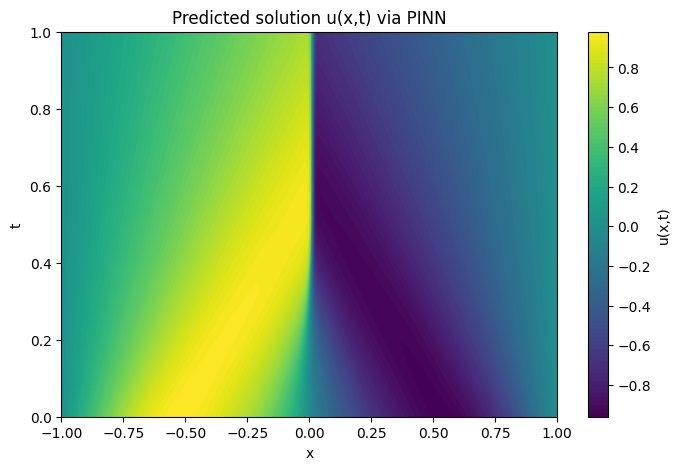

# Burgers' Equation using Physics-Informed Neural Networks (PINNs)

This project demonstrates how to solve the 1D Burgers' equation using **Physics-Informed Neural Networks (PINNs)** in PyTorch. PINNs are a novel class of deep learning models that incorporate **physical laws (PDEs)** into the training process using **automatic differentiation** and **collocation methods**.

---

## Key Features

- Solves 1D Burgers’ Equation using PINNs  
- Implements automatic differentiation with PyTorch  
- Incorporates collocation points for PDE residual loss  
- Visualizes solution and residual errors  
- Modular and clean project structure  

---

## Project Structure
```bash
├── notebooks/ # Jupyter notebooks for step-by-step implementation
├── src/ # Source code: model, physics, training logic
├── results/ # Plots and logs
├── requirements.txt # pip-based dependencies
├── environment.yml # Conda environment setup
```

---

## Installation

### Option 1: Using pip

```bash
pip install -r requirements.txt
```

### Option 2: Using conda

```bash
conda env create -f environment.yml
conda activate burgers-pinns
```

---

## How to Run

### Run from Jupyter Notebook

```bash
cd notebooks/
jupyter lab
Open PINN_1D_Burgers_equation.ipynb and run all cells.
```

### Run from Script (Optional)

```bash
python src/train.py
```

---

## Results

- Predicted vs Ground Truth for Burgers' Equation

- PDE Residual heatmaps

- Loss curves and training diagnostics

All results are saved inside the `result/` folder.



---

## License
This project is open-sourced under the [MIT License](https://github.com/veydantkatyal/PINN-1D-burger-equation/blob/main/LICENSE).
